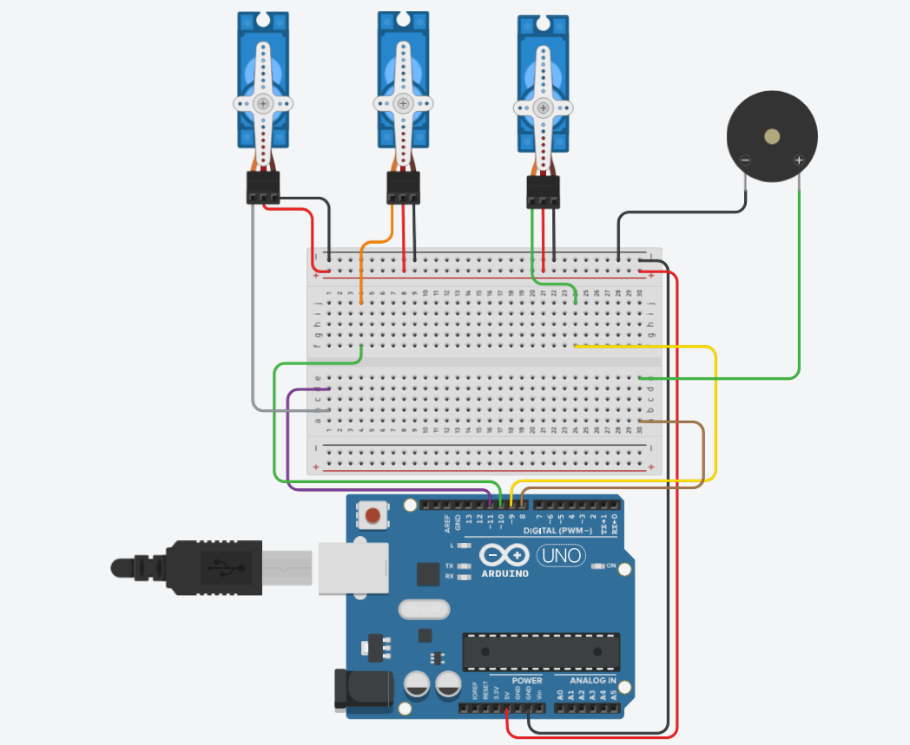

# Project: Multi-Servo Sequential Controller with Buzzer Notification

## 📝 Description
This project demonstrates advanced timing and multi-actuator coordination. It features three micro-servos that move to specific angular positions ($90^{\circ}$, $135^{\circ}$, and $180^{\circ}$) in a sequence. Once the mechanical movement is complete, an acoustic signal is triggered via a piezo buzzer. Finally, the system resets all actuators to the home position ($0^{\circ}$) before restarting the loop.

---

## 🖼️ Circuit Layout
The circuit utilizes PWM (Pulse Width Modulation) pins to control the servo positions and a digital output for the buzzer.

### Pin Mapping (Based on Diagram)
| Component | Arduino Pin | Type | Function |
| :--- | :--- | :--- | :--- |
| **Servo 1** | D11 | PWM | Moves to $90^{\circ}$ |
| **Servo 2** | D10 | PWM | Moves to $135^{\circ}$ |
| **Servo 3** | D9  | PWM | Moves to $180^{\circ}$ |
| **Piezo Buzzer** | D2 | Digital | Alert Signal (0.5s) |

---

## ⚙️ How it Works

### 1. Mechanical Sequence
The Arduino uses the `Servo.h` library to send precise signals to the three SG90 motors. The sequence is non-simultaneous to prevent high current spikes that could reset the controller.

### 2. Acoustic Alert
After the third servo reaches its target, Pin 2 triggers the piezo buzzer. This provides a clear sensory confirmation that the mechanical cycle has concluded.

### 3. Automatic Reset
To ensure the system is ready for the next iteration, a reset command is sent to all servos simultaneously, returning them to the $0^{\circ}$ reference point.

---

## 🛠️ Assembly Instructions

1. Power: Connect Arduino 5V and GND to the breadboard power rails.
2. Servos: Connect the Red (VCC) and Brown (GND) wires of all servos to the power rails. Connect the Orange (Signal) wires to pins 11, 10, and 9.
3. Buzzer: Connect the positive terminal (long leg) to D2 and the negative terminal to GND.
4. Note on Power: When running three servos, it is recommended to power the Arduino via a wall adapter rather than just USB to ensure stable current.

